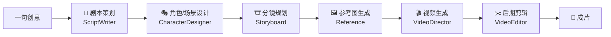

<div align="center">

# DramaCoo · 一句话到一部成片的 AI 短片创作 Agent

**给一句创意，自动走完「剧本 → 角色 → 分镜 → 参考图 → 视频 → 剪辑」全流程，持续产出可查看、可确认、可修改、可续写的中间资产，最终交付成片。**

<p>
  <a href="./LICENSE"></a>
  
  
  
  
  
  
  
</p>

</div>

---

DramaCoo不是「文生视频」的黑盒，而是一条**可协作的 AI 导演流水线**：一个编排器驱动 6 阶段状态机，每个阶段由专职 Agent 负责，前一阶段的产物决定后一阶段的输入；所有关键节点都可视化、可编辑、可在修改后继续生成。

## 📊 工作流程



每个阶段完成后会**停下等待人工确认**，可修改产物后继续生成，不必从头再来。

## ✨ 功能特性

| 能力 | 说明 |
| --- | --- |
| 🎬 从创意到成片 | 一条链路打通剧本、角色、分镜、参考图、视频与剪辑，交付完整成片 |
| 🖼️ 分镜驱动的可控创作 | 结构化剧本 + 分镜规划 + 参考图，让角色一致性、镜头表达与画面风格更稳定 |
| ✍️ 可修改、可续写 | 支持剧情/分镜智能续写，各阶段修改后重新生成，不必每次从头开始 |
| 🎥 三种视频生成方式 | 首帧生视频（推荐）/ 首尾帧生视频 / 参考图生视频，可切换并分别配置模型 |
| 🧩 多模型可插拔 | LLM / VLM / 图像 / 视频各环节可在多家服务商间切换 |
| 🧰 项目库 + 素材库 | 项目有独立存放区域；好素材沉淀为可复用资产，支持手动上传 |
| 🔁 任务记录与失败重试 | 每次图片/视频生成落一条任务记录，失败带原因，一键重试失败项 |
| 🖼️ 缩略图 / 海报帧 | 图片自动产缩略图、视频自动抽海报帧，列表加载更快 |
| ⚡ 一键流水线 | 动作迁移、数字人口播等固定场景一键生成 |
| 🛠️ 临时工作台 | 单次 LLM / VLM / 文生图 / 图生图 / 视频调试 |
| 📲 本地部署、产物留存 | 后端 + Web 前端本地运行，全链路资产留存在本机 |

## 🧱 技术栈

| 层 | 技术 |
| --- | --- |
| 🎨 前端 | Next.js 16 · React 19 · Tailwind CSS v4 |
| ⚙️ 后端 | FastAPI · Python 3.10+（推荐 3.12） |
| 🧠 编排 | 单编排器 + 6 阶段 Agent 状态机，会话持久化 |
| 🤖 模型 | 通义 DashScope · 火山方舟 ARK · 可灵 Kling · OpenAI · Gemini · DeepSeek |
| 💾 存储 | SQLite（项目表 + 素材表 + 任务表）+ JSON（会话状态） |
| 🎞️ 视频处理 | imageio-ffmpeg 内置跨平台 ffmpeg，开箱即用 |

## 📁 目录结构

```text
DramaCoo/
├── backend/
│   ├── api/               # FastAPI 路由（workflow/sessions/stages/sandbox/pipelines/config/assets/files）
│   ├── core/              # orchestrator 状态机、各阶段 Agent、SQLite 数据层、任务/缩略图/ffmpeg/素材库
│   ├── models/            # LLM/VLM/图像/视频客户端（dashscope/ark/kling/openai/gemini/deepseek）
│   ├── pipelines/         # 一键流水线（standard / action_transfer / digital_human）
│   ├── prompts/           # 各阶段提示词
│   ├── tests/             # 后端离线 mock 测试
│   ├── config.yaml.example # 配置模板（真实密钥填在本地 config.yaml，不提交）
│   └── code/              # 运行数据：sessions、tasks、SQLite、生成产物（已 gitignore）
├── frontend/              # Next.js 产品前端（工作室/项目库/素材库/临时工作台/设置）
├── install.sh / install.bat
├── docs/                  # 项目状态、阶段文档、PRD、证据包
├── SKILL.md / references/ # Agent Skill 工作流规则与 API 文档
├── README.md
└── LICENSE
```

## 🚀 快速开始

### 环境要求

- **Python 3.10+**（推荐 3.12；部分代码使用 3.10+ 语法，3.9 无法运行）
- **Node.js 18+** / **npm 9+**
- **ffmpeg 无需手动安装**：后端通过 `imageio-ffmpeg` 内置跨平台 ffmpeg，系统装有 ffmpeg 时优先使用系统版本（可用 `FFMPEG_BIN` 环境变量覆盖）
- 推荐使用 [`uv`](https://docs.astral.sh/uv/) 管理后端环境

### 方式一：一键安装（推荐）

```bash
git clone https://github.com/jiazhengjian/DramaCoo.git
cd DramaCoo
chmod +x install.sh
./install.sh
```

安装脚本会检查 Python / Node.js / npm，安装前后端依赖（含内置 ffmpeg），并把 `backend/config.yaml.example` 复制为 `backend/config.yaml`。

只想装依赖、暂时跳过前端构建：

```bash
XYQ_SKIP_FRONTEND_BUILD=1 ./install.sh
```

### 方式二：手动安装

```bash
# 后端
cd backend
uv sync --python 3.12          # 没有 uv 时可用 python -m venv venv && pip install -r requirements.txt
cp config.yaml.example config.yaml   # 然后填入 API Key、确认默认模型

# 前端（新终端）
cd frontend
npm install
```

### 启动

```bash
# 后端
cd backend
uv run python api_server.py            # http://localhost:8000

# 前端（新终端）
cd frontend
npm run dev                            # 开发模式；或 npm run build && npm start
```

打开 **http://localhost:3000**（或 `npm start` 指定的端口），在输入框写下创意即可开始创作。也可在前端「设置」页面填写 API Key 与默认模型，无需手改 YAML。

## ⚙️ 配置

后端配置统一保存在 `backend/config.yaml`（真实密钥只写在这里，**已加入 `.gitignore`，不要提交**）。可直接编辑，也可在前端「设置」页面修改。

```yaml
api_providers:
  openai:    { api_key: '', base_url: https://api.openai.com/v1 }
  gemini:    { api_key: '', base_url: https://generativelanguage.googleapis.com/v1beta }
  deepseek:  { api_key: '', base_url: https://api.deepseek.com/v1 }
  dashscope: { api_key: '', base_url: https://dashscope.aliyuncs.com/api/v1 }
  ark:       { api_key: '', base_url: https://ark.cn-beijing.volces.com/api/v3 }
  kling:     { access_key: '', secret_key: '', base_url: https://api-beijing.klingai.com }

models:
  llm: qwen3.5-plus
  vlm: qwen3.5-plus
  image_t2i: doubao-seedream-5-0-260128
  image_it2i: doubao-seedream-5-0-260128
  video_first_frame: wan2.7-i2v
  video_start_end: wan2.7-i2v
  video_reference: wan2.7-r2v
```

### 密钥与平台对应关系

| 平台 | 配置字段 | 常用用途 |
| :--- | :--- | :--- |
| **DashScope（通义）** | `dashscope.api_key` | 通义千问、通义万相 Wan 图像/视频 |
| **火山方舟 ARK** | `ark.api_key` | 豆包 Seedream 图像、Seedance 视频 |
| **Kling（可灵）** | `kling.access_key` / `secret_key` | 可灵视频生成 |
| **OpenAI** | `openai.api_key` | GPT 文本/视觉、OpenAI 图像 |
| **Gemini** | `gemini.api_key` | Gemini 文本/视觉 |
| **DeepSeek** | `deepseek.api_key` | DeepSeek 文本 |

只需填写你实际选用模型对应的平台密钥。可用模型清单以 `backend/models/config_model.py` 为准。

## 📡 API

| 方法 | 路径 | 说明 |
| --- | --- | --- |
| GET | `/api/health` | 健康检查 |
| POST | `/api/project/start` | 用一句创意启动项目 |
| POST | `/api/project/{session_id}/execute/{stage}` | 执行指定阶段 |
| GET | `/api/project/{session_id}/status` | 项目状态与各阶段进度 |
| GET | `/api/project/{session_id}/artifact/{stage}` | 获取某阶段产物 |
| PATCH | `/api/project/{session_id}/artifact/{stage}` | 修改某阶段产物 |
| POST | `/api/project/{session_id}/continue` | 确认后继续下一阶段 |
| POST | `/api/project/{session_id}/intervene` | 人工介入/干预 |
| POST | `/api/project/{session_id}/stop` | 停止任务 |
| GET | `/api/project/{session_id}/tasks` | 查看生成任务列表 |
| POST | `/api/project/{session_id}/tasks/retry_failed` | 一键重试失败任务 |
| GET / PATCH / DELETE | `/api/sessions...` | 项目会话列表 / 归档 / 删除 |
| GET | `/api/stages` | 六阶段定义 |
| GET / POST / DELETE | `/api/library...` | 全局素材库（上传/收藏/删除） |
| GET / PUT | `/api/config` | 读取/保存配置（密钥字段脱敏） |
| GET | `/api/models` | 可用模型清单 |
| POST | `/api/upload_file` / `/api/upload_media` | 文件/媒体上传 |
| POST | `/api/pipelines/{pipeline}/tasks` | 一键流水线（standard / action_transfer / digital_human） |
| GET | `/api/tasks` / `/api/tasks/{id}/events` | 流水线任务与事件流 |
| POST | `/api/sandbox/llm` / `vlm` / `t2i` / `i2i` / `video` | 临时工作台单次调试 |

错误结构统一为 `{"error": {"code", "message"}}`，不泄露堆栈；SSE 以 `done` 或 `error` 事件收尾。

## 🧪 测试

```bash
cd backend
uv run pytest            # 或 .venv/bin/python -m pytest（离线 mock 测试，不调用真实模型）
```

## 🗺️ 路线图

- [ ] 角色级 Agent 互评（编剧 / 导演 / 连贯性审查各自带 loop 与记忆，互相 review）
- [ ] 独立的跨镜头连贯性 Agent（人物 / 场景一致性审查，可打回重做）
- [ ] 并发分镜 Agent + 汇总（多镜头并行生成）

## 🙏 致谢

本项目基于开源项目 [FilmAgent / Video-Claw](https://github.com/HITsz-TMG/FilmAgent)（MIT License）二次开发，在此致谢原作者。

## 📄 License

[MIT](./LICENSE) © 2026（保留上游原始版权声明）
